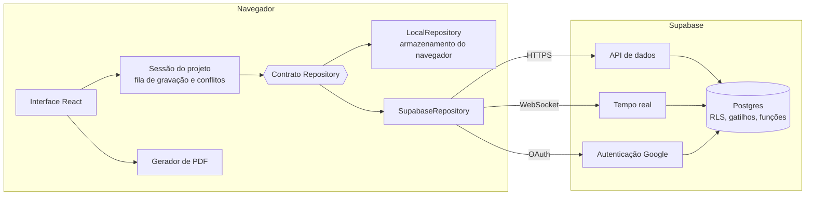

# AGITAR Canvas

Implementação digital do **Modelo de Gestão da Inovação Tecnológica (AGITAR Canvas)**, proposto na tese de doutorado de Presleyson Plínio de Lima (Universidade FUMEC, 2024) para apoiar a gestão da inovação em Pequenas e Médias Empresas (PMEs) de Tecnologia da Informação e Comunicação (TIC).

**Título da tese:** Modelo de Gestão da Inovação Tecnológica para Pequenas e Médias Empresas de Tecnologia da Informação e Comunicação.

**Aplicação publicada:** <https://presleyson.github.io/agitarcanvas/>

## Sumário

- [Sobre o AGITAR Canvas](#sobre-o-agitar-canvas)
- [Origem do projeto](#origem-do-projeto)
- [Objetivo](#objetivo)
- [Fundamentação acadêmica](#fundamentação-acadêmica)
- [Como funciona](#como-funciona)
- [Como utilizar](#como-utilizar)
- [Principais funcionalidades](#principais-funcionalidades)
- [Aplicações do AGITAR Canvas](#aplicações-do-agitar-canvas)
- [Arquitetura](#arquitetura)
- [Tecnologias utilizadas](#tecnologias-utilizadas)
- [Sistema de projetos](#sistema-de-projetos)
- [Persistência dos dados](#persistência-dos-dados)
- [Colaboração](#colaboração)
- [Permissões](#permissões)
- [Histórico e versões](#histórico-e-versões)
- [Exportação e impressão](#exportação-e-impressão)
- [Instalação](#instalação)
- [Configuração](#configuração)
- [Execução](#execução)
- [Banco de dados](#banco-de-dados)
- [Estrutura do projeto](#estrutura-do-projeto)
- [Design System](#design-system)
- [Testes](#testes)
- [Deploy](#deploy)
- [Boas práticas de desenvolvimento](#boas-práticas-de-desenvolvimento)
- [Limitações conhecidas](#limitações-conhecidas)
- [Contribuição](#contribuição)
- [Referência acadêmica](#referência-acadêmica)
- [Licença](#licença)

## Sobre o AGITAR Canvas

O AGITAR Canvas é uma plataforma digital de apoio à gestão da inovação tecnológica. Em cada projeto, ela apresenta em uma única tela um quadro com nove blocos nos quais a empresa registra, por meio de notas, os elementos centrais de um projeto de inovação: o planejamento estratégico, o problema a resolver, o mercado, as ideias geradas e selecionadas, os recursos financeiros e técnicos, os principais parceiros e os resultados esperados. Os projetos são salvos automaticamente, podem ser preenchidos em equipe e geram documentos prontos para impressão.

A aplicação tem origem em uma pesquisa de doutorado e foi desenvolvida a partir do modelo de gestão da inovação tecnológica proposto na tese. O software não é um produto independente da pesquisa: ele é o instrumento pelo qual o modelo foi levado às empresas participantes do estudo e é descrito no Capítulo 6 da tese ("Agitar Canvas Software").

**Público para o qual foi concebido:** PMEs do setor de TIC, seus gestores, comitês de inovação e agentes de inovação. Por sua origem acadêmica, pode também interessar a pesquisadores, professores e estudantes de gestão da inovação tecnológica.

## Origem do projeto

O projeto dá continuidade a uma linha de pesquisa iniciada na dissertação de mestrado do autor, que estudou os modelos de gestão da inovação em PMEs de TIC e se concentrou no MOGIT (Modelo de Gestão da Inovação Tecnológica) (Lima, 2020). A partir desse estudo e da implementação de projetos de gestão da inovação tecnológica, foram identificadas lacunas nos modelos existentes. Entre elas, a tese destaca o tratamento insuficiente da etapa de geração de ideias, frequentemente subordinada ao modelo global em vez de detalhada como fase própria.

A tese de doutorado propõe o AGITAR Canvas como evolução do MOGIT e parte da seguinte pergunta de pesquisa:

> Como o modelo de gestão da inovação tecnológica pode contribuir para o desenvolvimento das Pequenas e Médias Empresas (PMEs) no setor de Tecnologia da Informação e Comunicação (TIC)?

O contexto que motiva o trabalho é o das PMEs de TIC, que respondem por parcela relevante da inovação tecnológica e do emprego no país, mas que em geral dispõem de recursos financeiros e humanos limitados e podem não ter o conhecimento ou a experiência necessários para gerenciar projetos de inovação.

Este repositório contém a aplicação prática dessa proposta. O software transforma a metodologia descrita no trabalho acadêmico em um quadro que pode ser preenchido pelas organizações, de modo que o modelo deixe de ser apenas uma representação conceitual e passe a ser utilizado em atividades concretas de gestão da inovação.

## Objetivo

O objetivo geral da tese é desenvolver e aplicar um modelo de gestão da inovação tecnológica especificamente projetado para PMEs atuantes no setor de TIC. O software é o meio de aplicação desse modelo. Em termos práticos, o AGITAR Canvas busca apoiar as empresas a:

- **Organizar** as informações de um projeto de inovação tecnológica em uma estrutura única, com nomenclatura comum a todos os envolvidos.
- **Analisar** o problema a ser resolvido, o mercado-alvo e a viabilidade das ideias antes de comprometer recursos.
- **Planejar** a inovação de forma alinhada ao planejamento estratégico, com objetivos, metas, prazos e ações-chave.
- **Mapear** os recursos financeiros e técnicos e os parceiros necessários, considerando o ecossistema de inovação (universidades, parques tecnológicos, fornecedores, governos e investidores).
- **Acompanhar** os resultados esperados, que servem de referência para avaliar o projeto ao longo do tempo.

### Objetivo da plataforma

A plataforma oferece às empresas uma ferramenta para estruturar, registrar e acompanhar seus projetos de inovação tecnológica, do planejamento estratégico à avaliação de resultados. Ela combina três características:

- **Fundamentação acadêmica:** a estrutura, a ordem de preenchimento e as perguntas norteadoras seguem a tese que originou o modelo.
- **Aplicabilidade empresarial:** projetos salvos automaticamente, trabalho em equipe com papéis de acesso e documentos prontos para reuniões e workshops.
- **Experiência tecnológica atual:** interface responsiva, sincronização em tempo real e funcionamento tolerante a falhas de conexão.

## Fundamentação acadêmica

O AGITAR Canvas está fundamentado na seguinte tese de doutorado, utilizada como referência conceitual e metodológica para o desenvolvimento da solução:

| | |
|---|---|
| **Título** | Modelo de Gestão da Inovação Tecnológica para Pequenas e Médias Empresas de Tecnologia da Informação e Comunicação |
| **Autor** | Dr. Presleyson Plínio de Lima |
| **Orientador** | Prof. Dr. Luiz Cláudio Gomes Maia |
| **Instituição** | Universidade FUMEC, Faculdade de Ciências Empresariais |
| **Programa** | Pós-Graduação Stricto Sensu em Tecnologia da Informação e Comunicação e Gestão do Conhecimento |
| **Linha de pesquisa** | Tecnologias de Informação e da Comunicação |
| **Local e ano** | Belo Horizonte/MG, 2024 (defesa em 02/04/2024) |

### Metodologia da pesquisa

- **Construção do modelo:** revisão sistemática da literatura e fundamentação teórica sobre inovação tecnológica, gestão da inovação, cultura e ecossistema de inovação, e barreiras à inovação em PMEs de TIC.
- **Abordagem:** qualitativa, com múltiplos estudos de caso.
- **Amostra:** três PMEs de TIC de Belo Horizonte/MG, selecionadas por acessibilidade e mantidas em anonimato.
- **Coleta de dados:** questionário estruturado e entrevistas sobre a aplicação do software AGITAR Canvas, organizados nas mesmas nove categorias do quadro.
- **Análise:** mineração de texto em Python, com frequência de unigramas e bigramas, nuvens de palavras, análise de sentimentos com o modelo FinBERT-PT-BR e TF-IDF.
- **Ética:** pesquisa registrada na Plataforma Brasil (CAAE 76565923.0.0000.5155) e aprovada pelo Comitê de Ética em Pesquisa da Universidade FUMEC (parecer nº 6.646.848).

### O acrônimo AGITAR

Na tese, AGITAR designa um modelo estruturado para a gestão da inovação tecnológica, que abrange da identificação de oportunidades à implementação e ao aperfeiçoamento de soluções inovadoras:

| Letra | Fase | Descrição |
|---|---|---|
| **A** | Avaliação constante | Avaliação contínua das necessidades dos clientes e do mercado, de modo a identificar oportunidades para inovação. |
| **G** | Geração de ideias | Geração de ideias inovadoras, com incentivo à colaboração e à criatividade da equipe. |
| **I** | Implementação ágil | Implementação ágil e eficiente dos projetos de inovação, para que as ideias se transformem em soluções práticas. |
| **T** | Testes e validação | Teste e validação das novas soluções em ambiente controlado antes do lançamento no mercado. |
| **A** | Acompanhamento contínuo | Acompanhamento do desempenho e do retorno de clientes e partes interessadas. |
| **R** | Realinhamento constante | Realinhamento da gestão da inovação diante das mudanças do mercado e das evoluções tecnológicas. |

### Estrutura do modelo

O modelo (Figura 5.1 da tese) é representado em camadas concêntricas e descrito no Capítulo 5 nas seguintes seções:

- **Problema**, no centro do modelo.
- **Mercado**.
- **Ideia**, com o Processo de Geração de Ideias e o Processo de Seleção de Ideias.
- **Processo Contínuo de Inovação**, apoiado no conceito de ecossistema de inovação e na Hélice Tríplice, com os agentes: Universidade, Parques Tecnológicos, Comitê de Inovação, Governos, Organizações Setoriais, Investidores, Agentes de Inovação, Colaboradores, Departamentos, Sócios e Fornecedores.
- **Resultado**.
- **Planejamento Estratégico**, camada externa que envolve as demais.

### Resultados e limites do estudo

Segundo a tese, a aplicação do modelo nas empresas participantes indicou benefícios em organização interna, foco estratégico na inovação e aproveitamento dos recursos disponíveis, e as análises de sentimentos e TF-IDF reforçaram a percepção positiva do modelo.

A própria tese registra os limites dessa evidência: o estudo é qualitativo, abrange três empresas, teve número restrito de respondentes e não contou com pré-teste. O escopo foi delimitado a PMEs de TIC, sem incluir microempresas (menos de 20 colaboradores) nem grandes corporações (mais de 300 colaboradores). A aplicação em outros portes e setores é indicada como trabalho futuro.

## Como funciona

Cada projeto tem o seu quadro do AGITAR Canvas. Cada bloco traz um título, um texto de orientação e um botão de informação que abre a orientação metodológica completa, com as perguntas norteadoras e suas fontes. O usuário adiciona notas aos blocos, e o conjunto das notas forma o planejamento da inovação da empresa.

Há duas formas de trabalhar sobre o mesmo conteúdo:

- **Canvas:** visão geral das nove dimensões, na disposição do modelo, para análise e apresentação.
- **Etapas:** preenchimento guiado, um bloco por vez, na sequência descrita na tese.

### Disposição do quadro

```
+------------+----------+-------------+--------------+-----------+----------+
| Principais | Recursos | Recursos    | Ideias       | Geração   | Mercado  |
| Parceiros  | Técnicos | Financeiros | Selecionadas | de ideias +----------+
|            |          |             |              |           | Problema |
+------------+----------+-------------+--------------+-----------+----------+
| Resultados                          | Planejamento Estratégico            |
+-------------------------------------+-------------------------------------+
```

### Os nove blocos

Os nomes abaixo são os utilizados no software e correspondem às nove categorias de análise da tese.

| Bloco | O que registrar | Limite de notas |
|---|---|---|
| **Planejamento Estratégico** | Objetivos que a empresa espera alcançar, com metas, prazos e ações-chave. | 6 |
| **Problema** | Principais problemas que a empresa busca resolver e como eles afetam os clientes ou o mercado. | 2 |
| **Mercado** | Mercado-alvo no qual a empresa concentrará seus esforços de inovação. | 2 |
| **Geração de ideias** | Ideias vindas de pesquisas de mercado, sessões de brainstorming e outras técnicas. | 5 |
| **Ideias Selecionadas** | Ideias consideradas mais viáveis entre as geradas. | 5 |
| **Recursos Financeiros** | Potenciais fontes de financiamento, como investidores privados, capital de risco e subsídios governamentais. | 5 |
| **Recursos Técnicos** | Instituições ou organizações que podem fornecer suporte técnico, como universidades, parques tecnológicos ou fornecedores. | 5 |
| **Principais Parceiros** | Principais colaboradores, agentes, departamentos ou sócios. | 5 |
| **Resultados** | Resultados ou objetivos que a empresa espera alcançar com o projeto. | 6 |

Os limites de notas por bloco são definidos pelo software, em [`src/methodology/agitar.ts`](src/methodology/agitar.ts), e verificados também no banco de dados. Esse arquivo é a fonte única da metodologia na aplicação: reúne títulos, ordem, limites, textos de orientação, perguntas norteadoras com suas fontes e referências, e é usado pela interface, pela validação e pelos documentos exportados. A página **Metodologia** da aplicação apresenta esse conteúdo ao usuário.

### Relação entre o modelo e o quadro

O quadro do software organiza em blocos retangulares os elementos que o modelo conceitual apresenta em camadas. A leitura conjunta da Figura 5.1 e do Capítulo 6 da tese indica a seguinte correspondência:

| Modelo (Capítulo 5) | Blocos do software |
|---|---|
| Problema | Problema |
| Mercado | Mercado |
| Ideia (Geração e Seleção de Ideias) | Geração de ideias; Ideias Selecionadas |
| Processo Contínuo de Inovação (agentes do ecossistema) | Recursos Financeiros; Recursos Técnicos; Principais Parceiros |
| Resultado | Resultados |
| Planejamento Estratégico | Planejamento Estratégico |

### Sequência de preenchimento

O software não impõe ordem de preenchimento. A tese (seção 6.3) descreve o uso na seguinte sequência, em que cada bloco se apoia no anterior, e o modo **Etapas** da aplicação segue essa ordem:

1. **Planejamento Estratégico:** define os objetivos e orienta todas as atividades seguintes.
2. **Problema:** delimita o escopo do projeto.
3. **Mercado:** determina onde a empresa concentrará os esforços de inovação.
4. **Geração de ideias:** reúne as possibilidades antes de se optar por uma direção.
5. **Ideias Selecionadas:** destaca as soluções mais viáveis, segundo critérios definidos no planejamento estratégico.
6. **Recursos Financeiros:** mapeia as fontes de financiamento.
7. **Recursos Técnicos:** identifica as organizações que podem oferecer suporte técnico.
8. **Principais Parceiros:** identifica quem terá papel determinante no projeto.
9. **Resultados:** registra o que se espera alcançar e serve de referência para avaliação.

### Observações de transparência

- As perguntas norteadoras foram adaptadas do questionário de pesquisa da tese, com pequenas adequações de redação. As citações (autor e ano) são as da tese.
- O agrupamento dos blocos por cores (Estratégia, Contexto, Ideias, Recursos e parcerias) é um recurso de interface para facilitar a leitura. Ele não integra a formulação original do modelo.

## Como utilizar

### 1. Acessar a plataforma

Abra <https://presleyson.github.io/agitarcanvas/> em um navegador de computador, tablet ou celular. Não há instalação.

- **Modo nuvem** (servidor configurado): entre com uma conta Google. Os projetos ficam guardados no servidor e acompanham o usuário em qualquer dispositivo.
- **Modo local** (sem servidor configurado): não há login, e os projetos ficam guardados apenas no navegador em uso.

### 2. Criar um planejamento

Em **Meus Projetos**, clique em **Novo projeto** e informe o nome. Descrição, empresa ou organização, responsável, participantes e status são opcionais e podem ser alterados depois. Cada usuário pode ter vários projetos.

### 3. Preencher o AGITAR Canvas

1. No bloco desejado, clique em **Adicionar nota**.
2. Escreva o conteúdo da nota.
3. Clique fora da nota ou pressione `Esc` para concluir.

Quando o bloco atinge o limite de notas, o botão de inclusão deixa de ser exibido. O ícone de informação de cada bloco abre a orientação metodológica. Para preencher na sequência proposta pela tese, use a visão **Etapas**.

### 4. Salvar as informações

Não há botão de salvar. Toda alteração é gravada automaticamente, e o indicador no topo do projeto mostra o estado: *Salvando*, *Salvo* (com o horário) ou *Sem conexão*. O que é digitado sem conexão fica guardado no navegador e é enviado quando a conexão volta.

### 5. Reabrir um planejamento

Os projetos ficam listados em **Meus Projetos**, com a data da última atualização e o progresso de preenchimento. A lista pode ser pesquisada e ordenada. Projetos arquivados ficam em uma aba própria.

### 6. Atualizar um planejamento existente

- **Editar:** clique sobre a nota e altere o texto.
- **Mover para outro bloco ou reordenar:** use o menu de ações da nota.
- **Excluir:** use o menu de ações da nota. Um aviso permite desfazer a exclusão.
- **Dados do projeto:** nome, descrição, organização, responsável, participantes e status podem ser alterados no menu do projeto.
- **Histórico e versões:** o painel de histórico mostra quem alterou o quê e quando, e permite salvar e restaurar versões.

### 7. Compartilhar e colaborar

No modo nuvem, o proprietário compartilha o projeto por convite (email) ou por link de acesso controlado, com papel de editor ou de visualizador. As pessoas conectadas aparecem no topo do projeto, a nota em edição por outra pessoa é sinalizada e as alterações aparecem em tempo real. Ver [Colaboração](#colaboração) e [Permissões](#permissões).

### 8. Exportar ou imprimir

O menu **Exportar** gera o relatório em A4 e o canvas em página única em A3 ou A4, em PDF, e também envia esses documentos para impressão. Ver [Exportação e impressão](#exportação-e-impressão).

## Principais funcionalidades

- **Meus Projetos:** criar, abrir, editar dados, duplicar, arquivar, excluir, pesquisar e ordenar planejamentos.
- **Canvas:** as nove dimensões em uma única tela, na disposição espacial do modelo, com notas editáveis no próprio lugar.
- **Etapas:** preenchimento guiado, um bloco por vez, com a orientação metodológica e as perguntas norteadoras ao lado.
- **Salvamento automático** com indicação contínua do estado: salvando, salvo (com horário) ou sem conexão.
- **Colaboração em tempo real:** presença dos participantes, indicação de quem edita cada nota e tratamento de edições simultâneas.
- **Compartilhamento** por convite (email) e por link de acesso controlado, com papéis de proprietário, editor e visualizador.
- **Histórico** de quem alterou o quê e quando, e **versões** que podem ser restauradas.
- **Exportação em PDF** e **impressão** em A4 (relatório paginado) e A3 (canvas em página única).
- **Responsividade:** computador, tablet e celular.

A introdução do Capítulo 6 da tese menciona a criação de novos projetos e a exportação do projeto entre os tópicos de uso do software. As duas funcionalidades estão disponíveis nesta versão. O que ainda não está disponível é descrito em [Limitações conhecidas](#limitações-conhecidas).

## Aplicações do AGITAR Canvas

As possibilidades a seguir decorrem da estrutura do modelo e do uso descrito na tese. A pesquisa avaliou a aplicação do software em três PMEs de TIC, e o emprego em outros contextos deve considerar os limites indicados em [Fundamentação acadêmica](#fundamentação-acadêmica).

- **Planejamento da inovação:** o preenchimento na sequência proposta, a partir do Planejamento Estratégico, vincula cada iniciativa de inovação aos objetivos da empresa.
- **Diagnóstico organizacional:** blocos que permanecem vazios ou imprecisos apontam aspectos da gestão da inovação ainda não tratados pela empresa. O questionário do apêndice da tese, organizado nas mesmas nove categorias, pode servir de roteiro para esse levantamento.
- **Discussão estratégica:** o quadro reúne em uma única visão problema, mercado, ideias, recursos e resultados, o que oferece uma linguagem comum a sócios, gestores e equipes técnicas.
- **Workshops:** os blocos Geração de ideias e Ideias Selecionadas registram, respectivamente, o resultado de sessões de brainstorming e a escolha das ideias mais viáveis.
- **Reuniões de gestão:** o quadro pode ser revisto periodicamente por gestores ou pelo comitê de inovação, em linha com as fases de acompanhamento contínuo e realinhamento constante do modelo.
- **Estruturação de iniciativas de inovação:** um quadro por iniciativa documenta escopo, mercado, recursos e resultados esperados antes do início da execução.
- **Análise das capacidades relacionadas à inovação:** os blocos Recursos Financeiros, Recursos Técnicos e Principais Parceiros mapeiam os recursos internos e as relações com o ecossistema de inovação de que a empresa dispõe.

## Arquitetura



Decisões principais:

- **Aplicação de página única, hospedagem estática.** Não há servidor de aplicação próprio. O frontend conversa diretamente com o Supabase.
- **Autorização no banco de dados.** Quem pode ver ou alterar cada projeto é decidido por políticas de Row Level Security no Postgres, e não pelo código do navegador. Mesmo que o frontend seja adulterado, o banco não entrega nem aceita dados de projetos alheios.
- **Contrato de repositório.** A interface depende apenas de [`src/data/repository.ts`](src/data/repository.ts). Há duas implementações:
  - `LocalRepository`: dados no navegador, sem conta. É o modo usado quando o servidor não está configurado.
  - `SupabaseRepository`: Postgres, autenticação e tempo real.
- **Sessão do projeto fora do React.** [`src/state/ProjectSession.ts`](src/state/ProjectSession.ts) concentra salvamento automático, fila offline e resolução de conflitos em uma classe testável isoladamente.
- **Uma linha por nota, com versão.** Cada nota do canvas é um registro próprio. Duas pessoas editando notas diferentes nunca entram em conflito.

## Tecnologias utilizadas

| Camada | Tecnologia |
| --- | --- |
| Interface | React 19, TypeScript, React Router |
| Build | Vite |
| Componentes acessíveis | Radix UI (diálogo e menu), ícones Lucide |
| Estilo | CSS Modules e tokens em propriedades CSS |
| Tipografia | Inter e Source Serif 4, servidas pela própria aplicação |
| Dados, autenticação, tempo real | Supabase (Postgres, Row Level Security, Realtime, Auth) |
| PDF | @react-pdf/renderer (texto vetorial, fontes embutidas) |
| Testes | Vitest, Testing Library, Playwright, testes SQL em Postgres, PostgREST |
| Publicação | GitHub Actions e GitHub Pages |

## Sistema de projetos

Cada usuário pode ter vários projetos. Um projeto contém:

- nome, descrição, empresa ou organização, responsável e participantes;
- status (Rascunho, Em andamento, Concluído) e situação de arquivamento;
- datas de criação e de última atualização;
- as notas de cada dimensão da metodologia;
- pessoas com acesso e seus papéis;
- histórico de alterações e versões.

**Participantes** são as pessoas envolvidas no planejamento (texto livre, exibido nos relatórios). **Pessoas com acesso** são as contas que podem abrir o projeto na plataforma.

Projetos arquivados saem da lista principal e ficam somente para consulta. A exclusão é definitiva e remove notas, histórico e versões.

## Persistência dos dados

O salvamento é automático e é responsabilidade de `ProjectSession` ([`src/state/ProjectSession.ts`](src/state/ProjectSession.ts)). O modelo é de **sincronização por estado**: para cada nota alterada, a sessão guarda o estado desejado (texto, bloco e posição, ou exclusão) e o estado do servidor em que a alteração se baseou.

1. Toda alteração aparece na tela imediatamente e é **gravada no navegador antes de qualquer chamada de rede**. Ela só sai de lá quando o servidor confirma o estado desejado.
2. A digitação é fundida: a gravação acontece depois de uma breve pausa ou ao concluir a edição da nota. Criar uma nota e escrever nela gera uma única gravação.
3. **Sem conexão, com a sessão expirada ou diante de uma falha do servidor**, as alterações aguardam e são reenviadas, com intervalos crescentes, inclusive depois de fechar e reabrir o navegador. No modo nuvem, a última cópia conhecida do projeto também fica guardada, de modo que um projeto em uso pode ser recarregado sem conexão enquanto a sessão de acesso estiver válida.
4. Reenviar é sempre seguro. Cada envio compara o estado desejado com o estado atual do servidor, de modo que uma resposta perdida no caminho não duplica nem desfaz nada.
5. Uma alteração só é descartada quando o servidor a recusa de forma definitiva (falta de permissão ou projeto arquivado), e o usuário é avisado. Se o bloco de destino estiver cheio no servidor, a nota continua guardada até que haja lugar ou que seja movida.

O indicador no topo do projeto informa o estado a todo momento: *Salvando*, *Salvo* (com o horário), *Sem conexão*, *Sessão expirada*, *Falha ao salvar* (com nova tentativa) e *Conflito a resolver*.

Situações cobertas por testes: fechar o navegador, atualizar a página no meio da digitação, perda de conexão, resposta perdida, falha do servidor, duas abas do mesmo usuário, contas diferentes no mesmo navegador, sair da aplicação e, no modo nuvem, trocar de dispositivo.

As alterações pendentes ficam separadas por usuário, projeto e aba. Quando uma aba é fechada com alterações por enviar, a próxima sessão aberta naquele projeto as assume. Para saber se a aba dona ainda existe, a aplicação usa travas do navegador (Web Locks); em navegadores sem esse recurso, usa um sinal periódico. Ao sair da conta, a cópia para uso sem conexão é apagada do navegador; alterações ainda não enviadas permanecem guardadas para a volta.

No **modo local** os dados ficam apenas no navegador em uso. Limpar os dados do site apaga os projetos. Para uso continuado e em equipe, configure o servidor.

## Colaboração

Disponível no modo nuvem.

- **Sincronização:** alterações em projetos e notas são publicadas pelo banco e entregues aos participantes conectados. O servidor aplica as políticas de acesso antes de entregar cada alteração. Mudanças de acesso (entrada, troca de papel, remoção) são avisadas por um canal privado do projeto.
- **Presença:** o mesmo canal privado informa quem está conectado, em qual bloco e qual nota está editando. Uma nota em edição por outra pessoa aparece sinalizada e protegida contra edição acidental.
- **Concorrência:** controle otimista por versão, por nota, com **fusão de três vias** campo a campo (texto, bloco e posição):
  - o que só uma pessoa alterou é mantido: se uma move a nota e outra edita o texto, as duas alterações valem;
  - bloco e posição alterados pelas duas ficam com o valor de quem gravou por último;
  - texto alterado pelas duas é um **conflito**: quem grava depois vê a versão da outra pessoa e escolhe entre manter a sua ou adotar a dela. Enquanto não decide, o seu texto continua guardado no navegador;
  - a exclusão também informa a versão: uma nota cujo texto outra pessoa alterou depois do pedido de exclusão é mantida, e quem pediu a exclusão é avisado.
- **Limites por bloco:** verificados no banco com trava por projeto e bloco, de modo que duas pessoas não ultrapassam o limite ao mesmo tempo.
- **Reconexão:** ao restabelecer a conexão, ao voltar de um período em segundo plano e sempre que o canal em tempo real é retomado, o estado é relido do servidor e as alterações locais pendentes são reposicionadas sobre ele.

No modo local, abas do mesmo navegador se sincronizam entre si pelo mesmo mecanismo de interface, o que permite demonstrar e testar a colaboração sem servidor.

## Permissões

| Ação | Proprietário | Editor | Visualizador |
| --- | :---: | :---: | :---: |
| Ver canvas, histórico e versões | sim | sim | sim |
| Exportar e imprimir | sim | sim | sim |
| Duplicar (cria uma cópia própria) | sim | sim | sim |
| Criar, editar, mover e excluir notas | sim | sim | não |
| Editar dados do projeto | sim | sim | não |
| Salvar e restaurar versões | sim | sim | não |
| Convidar, alterar papéis e remover pessoas | sim | não | não |
| Criar e revogar links de acesso | sim | não | não |
| Arquivar, desarquivar e excluir o projeto | sim | não | não |

Formas de compartilhamento:

- **Convite por email.** O convite fica pendente até que a pessoa convidada o aceite. Ao entrar na plataforma com aquele email, ela vê o convite em **Meus Projetos** e escolhe aceitar ou recusar; só depois de aceitar passa a ter acesso. Ninguém é incluído em um projeto sem concordar. A plataforma não envia mensagens: o proprietário avisa a pessoa pelo próprio email (há um atalho para isso na tela).
- **Link de acesso controlado.** Concede o papel escolhido a quem abrir o link e entrar com uma conta. Pode ter validade e pode ser revogado. O link não dá acesso anônimo.

Garantias verificadas por testes automatizados (ver [Testes](#testes)):

- sem autenticação, nenhuma tabela ou função é acessível;
- quem não participa de um projeto não o vê nem o altera, por nenhuma rota;
- associações, convites, links, histórico e versões só são gravados por funções do servidor, que validam o papel de quem chama;
- um convite só pode ser visto, aceito ou recusado por quem entrou com o email convidado, e aceitar nunca reduz um papel que a pessoa já tinha;
- o proprietário, a versão das notas e o email do perfil não podem ser manipulados pelo cliente;
- um projeto arquivado não aceita alterações, nem por chamada direta à API.

Quando uma conta é excluída na autenticação do Supabase, os projetos de que ela era proprietária são excluídos, e sua participação em projetos de outras pessoas é removida. O histórico desses projetos mantém o nome de quem fez cada alteração.

## Histórico e versões

- **Histórico:** gatilhos no banco registram quem fez, quando e o que mudou (conteúdo anterior e posterior). Gravações seguidas da mesma pessoa na mesma nota são consolidadas em um único evento, para que o salvamento automático não polua a linha do tempo. O nome do autor é guardado no evento e continua legível depois que a pessoa deixa o projeto.
- **Versões:** fotografias do canvas.
  - *Manuais:* salvas pelo usuário em marcos importantes.
  - *Automáticas:* uma por dia de trabalho, criada antes da primeira alteração depois de 24 horas sem versões. São mantidas as 30 mais recentes.
  - *Antes de restauração:* ao restaurar uma versão, o estado atual é guardado, de modo que a restauração também pode ser desfeita.

A restauração recupera as **notas** do canvas. Os dados descritivos do projeto não são alterados.

## Exportação e impressão

Os documentos são gerados no navegador como PDF com texto vetorial e fontes embutidas. A impressão usa o mesmo PDF, o que garante resultado idêntico entre navegadores e respeita o tamanho do papel.

| Documento | Formato | Conteúdo |
| --- | --- | --- |
| Relatório A4 | A4 retrato, paginado | Identificação do projeto, data, organização, responsável, participantes, visão geral do canvas, conteúdo de cada dimensão na ordem da metodologia, rodapé institucional e numeração de páginas |
| Canvas A3 | A3 paisagem, página única | Todas as dimensões na disposição do modelo, para reuniões e workshops |
| Canvas A4 | A4 paisagem, página única | O mesmo canvas, para impressoras comuns |

No canvas de página única, o tamanho da fonte é ajustado ao volume de texto. Se nem o menor tamanho for suficiente, as notas são abreviadas e o documento informa que o conteúdo completo está no relatório A4.

Ao imprimir o canvas A3, selecione papel A3 e orientação paisagem no diálogo de impressão. Em celulares e tablets, o PDF abre em nova aba para impressão pelo visualizador do sistema.

## Instalação

**Requisitos**

- Node.js 22 ou superior
- npm
- Git

**Passos**

```bash
git clone https://github.com/presleyson/agitarcanvas.git
cd agitarcanvas
npm install
```

## Configuração

Sem configuração adicional, a aplicação funciona em **modo local**. A configuração a seguir é necessária para contas, colaboração e sincronização entre dispositivos (modo nuvem).

### 1. Criar o projeto no Supabase

Crie um projeto em <https://supabase.com> (por exemplo, com o nome `agitarcanvas`). O banco Postgres do projeto recebe as tabelas no esquema `public`.

### 2. Aplicar as migrações

No **SQL Editor** do projeto, execute os arquivos de [`supabase/migrations`](supabase/migrations) na ordem numérica:

1. `0001_schema.sql`
2. `0002_functions_triggers.sql`
3. `0003_policies.sql`
4. `0004_rpc.sql`
5. `0005_realtime.sql`

Não execute `supabase/tests/00_supabase_stub.sql`: ele existe apenas para os testes automatizados.

### 3. Ativar o login com Google

1. No Google Cloud Console, crie uma credencial **OAuth 2.0 Client ID** do tipo aplicação web. Em *Authorized redirect URIs*, informe `https://<referência-do-projeto>.supabase.co/auth/v1/callback`.
2. No Supabase, em **Authentication > Sign In / Providers > Google**, ative o provedor e informe o Client ID e o Client Secret.
3. Em **Authentication > URL Configuration**:
   - *Site URL:* `https://presleyson.github.io/agitarcanvas/`
   - *Redirect URLs:* acrescente o mesmo endereço e, para desenvolvimento, `http://localhost:5173/`
4. Ainda em **Authentication > Sign In / Providers**, mantenha desativados os provedores que a aplicação não usa, em especial o acesso anônimo e o cadastro por email e senha. Convites e permissões se apoiam no email confirmado pelo Google.

### 4. Informar as chaves à aplicação

Em **Project Settings > API**, copie a *Project URL* e a chave pública *anon*. Informe as duas conforme a seção seguinte.

### Variáveis de ambiente

| Variável | Descrição |
| --- | --- |
| `VITE_SUPABASE_URL` | URL do projeto Supabase |
| `VITE_SUPABASE_ANON_KEY` | Chave pública `anon` |
| `VITE_BASE` | Caminho base da publicação. Opcional. Padrão: `./` (relativo) em produção e `/` em desenvolvimento |

- **Desenvolvimento:** copie `.env.example` para `.env.local` e preencha.
- **Produção:** no GitHub, em **Settings > Secrets and variables > Actions > Variables**, crie `VITE_SUPABASE_URL` e `VITE_SUPABASE_ANON_KEY`. O próximo deploy passa a usar o servidor.

A chave `anon` é pública por projeto: vai para o navegador e não concede acesso por si só, porque todo acesso é filtrado por Row Level Security. **Nunca** use ou versione a chave `service_role`.

Sem as duas primeiras variáveis, a aplicação funciona em modo local.

## Execução

**Ambiente local**

```bash
npm run dev
```

A aplicação fica disponível em <http://localhost:5173/>.

**Outros comandos**

| Comando | O que faz |
| --- | --- |
| `npm run build` | Verifica os tipos e gera a versão de produção em `build/` |
| `npm run preview` | Serve a versão de produção localmente |
| `npm run typecheck` | Verificação de tipos |
| `npm test` | Testes unitários e de componentes |
| `npm run test:db` | Testes das regras de acesso no banco |
| `npm run test:api` | Testes do modo nuvem contra uma API real |
| `npm run test:e2e` | Testes de ponta a ponta em navegador |

Os conjuntos de testes são descritos em [Testes](#testes), e a publicação, em [Deploy](#deploy).

## Banco de dados

| Tabela | Conteúdo |
| --- | --- |
| `profiles` | Nome, email e foto de cada usuário, sincronizados a partir da autenticação |
| `projects` | Projetos e seus dados descritivos |
| `project_members` | Quem acessa cada projeto e com qual papel. Um proprietário por projeto |
| `notes` | Notas do canvas: bloco, conteúdo, posição, versão e exclusão lógica |
| `project_events` | Histórico: autor, momento, tipo, estado anterior e posterior |
| `project_versions` | Fotografias do canvas para restauração |
| `project_invites` | Convites por email ainda não aceitos |
| `project_links` | Links de acesso, com papel, validade e revogação |

Pontos de projeto:

- **RLS em todas as tabelas.** Leitura exige participar do projeto. Escrita exige papel de editor ou proprietário. O papel anônimo não tem privilégio algum.
- **Privilégios por coluna.** O cliente só pode gravar as colunas editáveis. Proprietário, versão, autoria e datas são definidos pelo servidor.
- **Funções do servidor** (`0004_rpc.sql`) para operações que envolvem mais de uma tabela ou exigem validação de papel: convidar, listar, aceitar e recusar convites, alterar papel, remover, sair, criar e revogar link, entrar por link, salvar e restaurar versão, duplicar.
- **Tempo real** (`0005_realtime.sql`): apenas `projects` e `notes` são publicadas como alterações de tabela. O canal privado de cada projeto só admite participantes, que nele publicam apenas presença.
- **Esquema `private`** para funções auxiliares, fora do alcance da API.
- **Exclusão lógica de notas** (`deleted_at`), que permite desfazer, restaurar versões e propagar exclusões em tempo real respeitando as políticas.
- **Limites da metodologia** validados pela função `agitar_block_limit`, que deve permanecer igual a `src/methodology/agitar.ts`. Para alterar um limite, mude os dois lugares, com uma nova migração.

Alterações de esquema devem ser feitas sempre por **nova migração numerada**, acompanhada de testes em `supabase/tests/access.test.sql`.

## Estrutura do projeto

```
.
├── .github/workflows/      Deploy e verificação completa
├── e2e/                    Testes de ponta a ponta (Playwright)
├── public/                 Arquivos estáticos
├── supabase/
│   ├── migrations/         Esquema, gatilhos, políticas, funções e tempo real
│   └── tests/              Testes do banco e da API
└── src/
    ├── methodology/        Definição do modelo AGITAR Canvas (fonte única)
    ├── domain/             Tipos, validação e regras independentes de interface
    ├── data/               Contrato de repositório e implementações (local, Supabase)
    ├── state/              Sessão do projeto, contexto de repositório e autenticação
    ├── design/             Tokens e estilos de base
    ├── components/         Componentes reutilizáveis (ui/) e miniatura do canvas
    ├── layout/             Cabeçalho, rodapé e páginas de estrutura
    ├── features/
    │   ├── auth/           Página de entrada e proteção de rotas
    │   ├── projects/       Meus Projetos
    │   ├── workspace/      Canvas, Etapas, notas e indicador de salvamento
    │   ├── history/        Histórico e versões
    │   ├── sharing/        Compartilhamento e entrada por link
    │   ├── export/         Documentos PDF e impressão
    │   └── methodology/    Página da metodologia
    ├── lib/                Utilitários (datas, erros, armazenamento)
    └── test/               Configuração e apoios de teste
```

## Design System

- **Tokens** em [`src/design/tokens.css`](src/design/tokens.css): cores, tipografia, espaçamento, raios, sombras e movimento. Componentes não declaram valores literais.
- **Componentes** em [`src/components/ui`](src/components/ui): botão, campos de formulário, lista de itens, selo, avatar, diálogo e painel lateral, menu, alternância, avisos, estado vazio, esqueleto de carregamento, barra de progresso e faixa informativa.
- **Tipografia:** Source Serif 4 em títulos e Inter na interface.
- **Cores das dimensões:** definidas uma única vez nos tokens e espelhadas no tema dos PDFs ([`src/features/export/pdf/theme.ts`](src/features/export/pdf/theme.ts)).
- **Acessibilidade:** navegação por teclado, foco visível, rótulos para leitores de tela, alvos de toque de pelo menos 40 px, respeito à preferência por menos movimento e campos com 16 px em telas de toque para evitar zoom automático.
- **Responsividade:** o canvas usa a disposição do modelo em telas largas, três colunas em telas médias e lista na ordem de preenchimento em telas pequenas, com um mapa do canvas para navegação.

## Testes

| Conjunto | Comando | O que verifica |
| --- | --- | --- |
| Unitários e de componentes | `npm test` | Sessão do projeto (gravação, falhas de rede e do servidor, respostas perdidas, conflitos, fusão, pendências entre abas e sessões), modo local, validações, histórico, compartilhamento, convites, ajuste e geração dos PDFs |
| Banco de dados | `npm run test:db` | Mais de cem verificações de políticas de acesso, privilégios, gatilhos, limites, histórico, versões, convites, links, projeto arquivado e exclusão de conta |
| API | `npm run test:api` | `SupabaseRepository` contra Postgres e PostgREST reais: consultas, relacionamentos, funções, controle de versão e erros |
| Ponta a ponta | `npm run test:e2e` | Fluxos completos em computador, tablet e celular, colaboração entre abas, recarga durante a digitação, exportação de PDF |

Os testes de banco e de API precisam de um Postgres. Informe um servidor descartável em `TEST_DATABASE_URL` (o usuário precisa poder criar bancos e papéis) ou tenha os binários do Postgres instalados. O teste de API também requer o binário `postgrest` no `PATH`.

Os testes de ponta a ponta usam a versão compilada: rode `npm run build` antes. Na primeira vez, instale os navegadores com `npx playwright install`.

## Deploy

A publicação é automática. O fluxo [`deploy.yml`](.github/workflows/deploy.yml) roda a cada alteração na branch `main`: instala, verifica tipos, executa os testes unitários, gera o build e publica o diretório `build/` na branch `gh-pages`, origem do GitHub Pages. Se um teste falhar, o site não é atualizado.

O fluxo [`tests.yml`](.github/workflows/tests.yml) executa a verificação completa (banco, API e navegadores, incluindo o motor do Safari). Ele é independente do deploy.

Publicação manual, a partir de uma cópia local com permissão de escrita no repositório:

```bash
npm run deploy
```

A versão compilada usa caminho base relativo e funciona em qualquer endereço de publicação sem nova compilação. Ao publicar em outro endereço, ajuste a *Site URL* e as *Redirect URLs* no Supabase. Defina `VITE_BASE` apenas se for necessário fixar um caminho base absoluto.

## Boas práticas de desenvolvimento

- **Metodologia em um só lugar.** Textos, limites e ordem dos blocos vivem em `src/methodology/agitar.ts`. Não os duplique em componentes.
- **Interface sem regra de acesso.** A interface pode esconder o que o usuário não pode fazer, mas a decisão é sempre do banco. Toda regra nova de permissão começa por uma política ou função, com teste em `supabase/tests`.
- **Dependa do contrato.** Componentes usam `Repository` e `ProjectSession`. Não chame o cliente Supabase diretamente da interface.
- **Erros com código estável.** Use `AppError` (`src/lib/errors.ts`). Mensagens ao usuário ficam em português e sem termos técnicos.
- **Tokens, não valores.** Cores e medidas vêm de `tokens.css`.
- **Teste junto com a mudança.** Regras de dados em testes unitários, permissões em testes SQL, fluxos em testes de ponta a ponta.
- **Migrações imutáveis.** Não edite uma migração já aplicada em produção. Crie outra.
- **Commits objetivos**, em português, iniciados por um verbo que descreve a alteração técnica (Adiciona, Corrige, Remove). Um assunto por commit.
- **Antes de enviar:** `npm run typecheck`, `npm test` e `npm run build`.

## Limitações conhecidas

- O login disponível é por conta Google. Outros provedores podem ser ativados no Supabase e exigem um botão correspondente na página de entrada.
- A plataforma não envia emails. Convites dependem de o proprietário avisar a pessoa convidada.
- Os PDFs incluem o conjunto de caracteres latino. Caracteres de outros alfabetos e emojis podem não ser impressos.
- Projetos do modo local não são migrados automaticamente para uma conta. Use a exportação em PDF para guardar o conteúdo.
- A sincronização em tempo real e o login dependem dos serviços do Supabase e não são cobertos pelos testes automatizados deste repositório, que exercitam o banco, a API de dados e a interface. Depois de configurar o servidor, valide os dois com duas contas antes do uso em equipe.
- Alterações feitas em um projeto e ainda não enviadas ficam guardadas no navegador em que foram feitas. Elas são enviadas quando o projeto é aberto novamente naquele navegador, com a mesma conta.
- Ao desfazer a exclusão de uma nota, a opção vale enquanto o aviso estiver na tela do projeto.
- Abrir a aplicação sem conexão exige uma sessão de acesso ainda válida. Com a sessão expirada, a página de entrada é exibida; o que não havia sido enviado continua guardado e é enviado depois do próximo login.

## Contribuição

Contribuições são bem-vindas por meio de issues e pull requests.

1. Crie uma branch a partir de `main`.
2. Faça as alterações e execute `npm run typecheck`, `npm test` e `npm run build`.
3. Abra um pull request descrevendo a mudança e sua motivação.

Como o software implementa um modelo acadêmico, alterações nos nomes, na quantidade ou no significado dos blocos devem preservar a correspondência com a tese. Novas funcionalidades devem ser acompanhadas da atualização deste README, na seção [Principais funcionalidades](#principais-funcionalidades).

## Referência acadêmica

Ao utilizar o AGITAR Canvas em trabalhos acadêmicos, relatórios ou publicações, recomenda-se citar a tese que o fundamenta. O arquivo [`CITATION.cff`](CITATION.cff) traz os mesmos dados em formato legível por ferramentas de citação.

**ABNT**

> LIMA, Presleyson Plínio de. **Modelo de gestão da inovação tecnológica para pequenas e médias empresas de tecnologia da informação e comunicação**. 2024. 261 f. Tese (Doutorado em Tecnologia da Informação e Comunicação e Gestão do Conhecimento) – Faculdade de Ciências Empresariais, Universidade FUMEC, Belo Horizonte, 2024.

**BibTeX**

```bibtex
@phdthesis{lima2024agitar,
  author  = {Lima, Presleyson Plínio de},
  title   = {Modelo de Gestão da Inovação Tecnológica para Pequenas e Médias Empresas de Tecnologia da Informação e Comunicação},
  school  = {Universidade FUMEC},
  address = {Belo Horizonte},
  year    = {2024},
  type    = {Tese (Doutorado em Tecnologia da Informação e Comunicação e Gestão do Conhecimento)}
}
```

**Trabalho anterior do autor**

> LIMA, Presleyson Plínio de. **Os modelos de gestão da inovação em pequenas e médias empresas de tecnologia da informação e comunicação**. 2020. Dissertação (Mestrado) – Universidade FUMEC, Belo Horizonte, 2020.

## Licença

Este repositório ainda não define uma licença. Até que um arquivo de licença seja adicionado, o uso, a modificação e a redistribuição do código dependem de autorização do autor.
